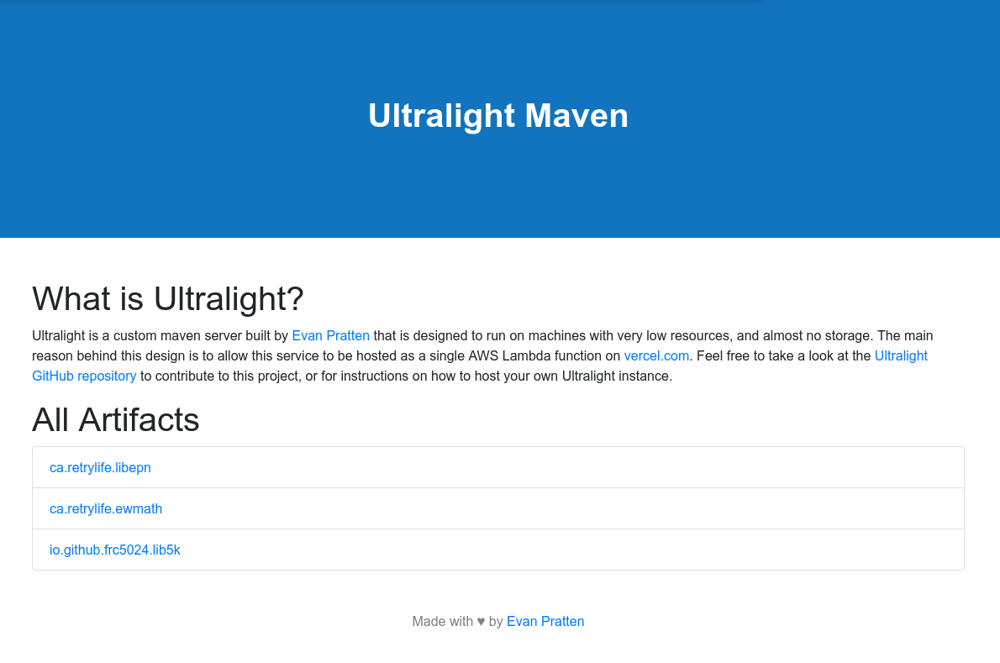
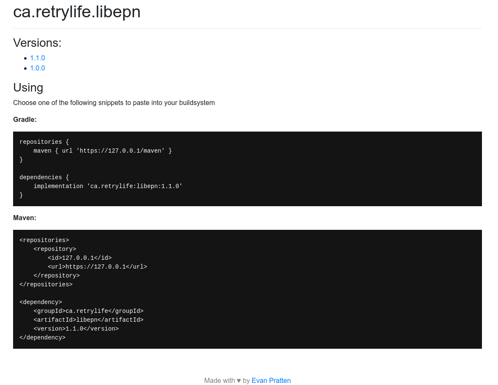

# Ultralight 
Ultralight is a custom maven server that is designed to run on machines with very low resources, and almost no storage. The main reason behind this design is to allow this service to be hosted as a single AWS Lambda function on [vercel.com](https://vercel.com).

## How it works

> Ultralight pretends to be a maven server

Ultralight is designed not to be an artifact repository itself, but to pretend to be one, then in the background, forward all requests to third party servers. When a user or buildsystem makes a request to the maven url, Ultralight will:

 1. Check to see if the requested artifact is listed in `sources.yml`
 2. Ask the GitHub API for that artifact's commit history
 3. Ensure the requested version is a valid commit tag
 4. Redirect the user to a GitHub CDN URL containing the requested JAR file

Ultralight will generate a `maven-matadata.xml` and a `pom` file on-the-fly to make any calling buildsystem think this is a valid maven server.

## Setting up your own instance for free

Setting up your own instance is easy. Just [fork this repository](https://github.com/Ewpratten/ultralight/fork), make any needed edits to [`sources.yml`](https://github.com/Ewpratten/ultralight/blob/master/sources.yml), then set up an account on [vercel.com](https://vercel.com) and publish your forked repository. Vercel allows users to set up [custom domain names](https://vercel.com/docs/custom-domains) for free.

## Screenshots

*Artifacts listing*

*Generated installation instructions for an artifact*